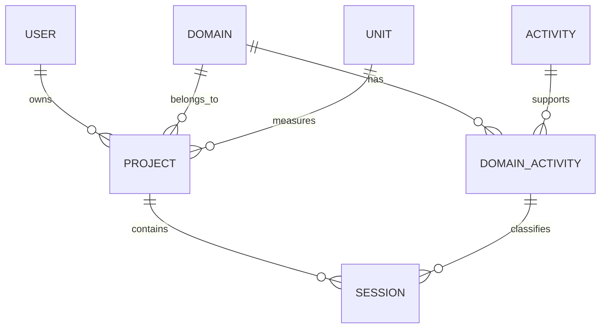

# Life Milestone Tracker

# Data Model - Entity Relationship Diagram (ERD)

Version: 1.0

Status: Frozen

Author: Elnoe

Last Updated: 2026-07-23

---

# Purpose

This document describes the logical relationships between the entities of the Life Milestone Tracker database.

The ERD represents the normalized relational model independently of the storage engine.

Version 1.0 is designed as a single-user application.

The User entity is retained for structural consistency and future extensibility.

Version 1.0 contains one user record only.

---

# Entity Relationship Diagram

```text
User
 │
 └────── 1:N ──────► Project
                      │
                      ├──────► Domain
                      │
                      ├──────► Unit
                      │
                      │
                      ▼
                   Session
                      │
                      ▼
               DomainActivity
                  ▲       ▲
                  │       │
              Domain   Activity
```

---

# Relationship Summary

| Parent Entity | Child Entity | Cardinality |
|---------------|--------------|-------------|
| User          | Project      | 1 : N |
| Domain        | Project      | 1 : N |
| Unit          | Project      | 1 : N |
| Project       | Session      | 1 : N |
| Domain        | DomainActivity | 1 : N |
| Activity      | DomainActivity | 1 : N |
| DomainActivity | Session     | 1 : N |

---

# Mermaid ERD



---

# Notes

This diagram shows only logical relationships.

Primary keys, foreign keys, field definitions, business rules, and normalization decisions are documented in:

Derived values such as milestones, achievements, and project statistics are intentionally omitted from the ERD because they are computed by the application rather than stored in the database.

01_database_schema.md

---

# Version 1.0 Constraints

The following entities are system-defined:

- Domain
- Activity

Users cannot create new Domains or Activities.

Users can create new Projects and record Sessions.

Units are also system-defined.

Users cannot create new Units.